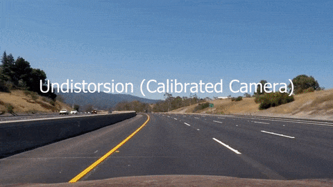

# Advanced Lane Finding
[](http://www.udacity.com/drive)

[//]: # (Image References)

[cal_input]: ./camera_cal/calibration2.jpg "Image used for calibration"

[p_cal]: ./output_images/pipeline_calibration.jpg "Camera calibration"
[p_undistorted]: ./output_images/pipeline_undistorted.jpg "Undistorted image"
[p_color_thresh]: ./output_images/pipeline_color.jpg "Color thresholded image"
[p_gradient_thresh]: ./output_images/pipeline_gradient.jpg "Gradient thresholded image"
[p_thresh]: ./output_images/pipeline_thresholded.jpg "Final thresholded image"
[p_src_dst]: ./output_images/pipeline_src_dst.jpg "Source and destination of the warping"
[p_warped]: ./output_images/pipeline_warped.jpg "Thresholded and warped image"
[p_lanes]: ./output_images/pipeline_lanes.jpg "Sliding windows and lanes detection"

[](https://www.youtube.com/watch?v=H00KJRCV5dA "Advanced Lane Detection Pipeline")

Overview
---
This repository contains an implementation of a road lanes detection pipeline that can be applied to images or videos and that uses various computer visions techniques to extract the polynomials of the road lanes from an image.

The project contains various python scripts that allow to:

* Compute the camera calibration matrix and distortion coefficients given a set of chessboard images.
* Apply a distortion correction to raw images.
* Create a thresholded binary image.
* Apply a perspective transform to rectify binary image to a "birds-eye view".
* Detect lane pixels and fit to find the lane boundary.
* Determine the curvature of the lane and vehicle position with respect to center.
* Warp the detected lanes boundaries back onto the original image.
* Output visual display of the lane boundaries and numerical estimation of lane curvature and vehicle position.

Getting Started
---

The project uses [OpenCV](https://opencv.org/) for most of the transformations, make sure that [ffmpeg](https://www.ffmpeg.org/) is setup in order to process the video.

The project is split in various python scripts, in particular it comes with the following:

#### [Camera Calibration](./camera_calibration.py)

The script is used to calibrate a camera to fix distorsions, the idea is to capture a set of images of a chessboard from different perspectives so that it can be used to detect the corners and compute the coefficients to correct the distorsion in the images. The coefficients are saved in an output pickle file.

The script can be run taking in input a folder containing calibration images using 

```bash
python camera_calibration.py --parameter_name=parameter_value
```

The supported parameters are as follows:

* **filepath** The path (pattern) where to find the calbration images; defaults to *camera_cal*
* **output** The output pickle file that will contain the distorsion coefficients; defaults to *camera_cal/calibration.p*
* **corners_folder** Where to save the intermediate images with the detected corners; defaults to *output_images/calibration*
* **rows** The number of rows in the chessboard images; defaults to *6*
* **cols** The number of columns in the chessboard images; defaults to *9*

![alt text][p_cal]

#### [Image Processing](./img_gen.py)

The script is used to run the pipeline for a set of images contained into an input folder, the output will be a set of images, one for each step of the pipeline. The script can be run as follows:

```bash
python img_gen.py --parameter_name=parameter_value
```

Where the supported parameters are as follows:

* **dir** The path (pattern) where to find the images to process; defaults to *test_images*
* **output** The folder where to save the output images; defaults to *output_images*
* **calibration_data_file** The path of the pickle file containing the calibration data for the camera; defaults to *camera_cal/calibration.p*
* **w_width** The width of the windows used for the lane search
* **w_height** The height of the windows used for the lane search
* **w_margin** The margin of the windows used for the lane search

![alt text][p_lanes]

#### [Video Processing](./video_processor.py)

The script is used to process an input video running the whole pipeline and outputting an annotated version of the video with the detected lanes. It can be run using:

```bash
python video_processor.py path_to_video.mp4 --parameter_name=parameter_value
```

Where the supported parameters are:

* **calibration_data_file** The path of the pickle file containing the calibration data for the camera; defaults to *camera_cal/calibration.p*
* **failed_frames_dir** The path to the folder where to save the frames where the detection failed; defaults to *failed_frames*
* **smooth** The number of frames to use for smoothing; defaults to *5*
* **start** The start of the video clip for trimming
* **end** The end of the video clip for trimming
* **split** True if a video for each stage of the pipeline should be output, false if only the final video should be saved; defaults to false
* **debug** True if additional debugging information should be displayed; defaults to false

